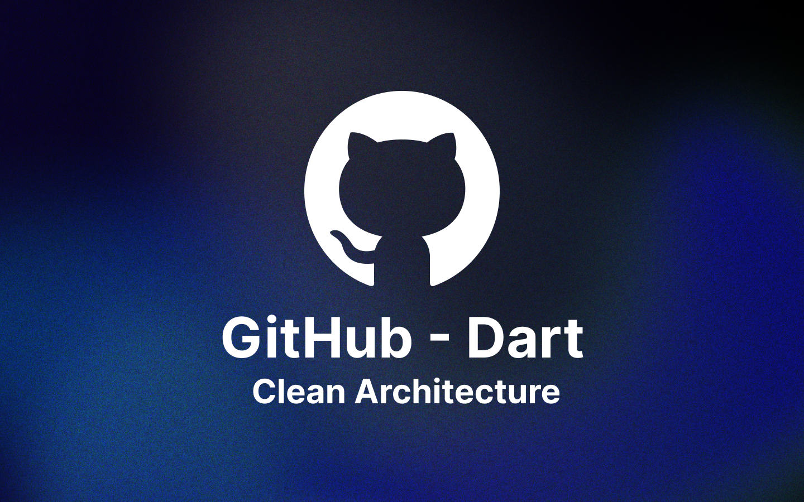

<a href="https://github.com/whosramoss/clean-dart-github">
  
  <h1 align="center">clean-dart-github</h1>
</a>

<p align="center">
  Project implementing clean architecture consuming data from Github Api
</p>

<div align="center">


<br/>


</div>
<br/>
<br/>

## How to install

```bash
  # Clone the project
  git clone https://github.com/whosramoss/clean-dart-github/

  # Go to the github_commons directory
  cd .\clean-dart-github\github_commons

  # Install dependencies of github_commons
  flutter pub get

  # Open the project that uses a state manager (e.g.:github_mobx)
  cd ..\github_mobx\

# Install dependencies of state manager 
  flutter pub get

  # Run the project 
  flutter run
```

# About the Project
This project is a proof of concept to test the [Flutterando](https://github.com/Flutterando) Clean architecture proposal  ([Clean-Dart](https://github.com/Flutterando/Clean-Dart)) with different state managers handling data provided by the API of the Github using Flutter 3.

Overrall, the architecture of the software must follow clear contexts of maintainability and scalability, that being said, it is extremely important to evaluate the architectural structure of the product even before the development, to result in a more versatile application whereupon it improves the ability of the developers to improve or fixing features in a short time.

# About Clean Dart
Following the Clean Dart principles, we must separate our project into 4 layers: 
1. `Presenter`
2. `Domain` 
3. `Infrastructure` 
4. `External`
 
Highlighting that the `Presenter` layer is responsible for allocating _pages_, _widgets_ and _state management_ , it becomes understandable to group `Domain`, `Infra`, `External` layers and their respective _unit tests_ in a single project being exported as a dependency, so we can have multiple separate repositories with different state management approaches  using the same business logic and components.

Still with a top-down view, it's possible to notice that as the components and assets (fonts, images) of each project will be the same, so we can allocate the widgets in `github_commons` as well.

# About Github API
The project works with the Github API through the requests:
1. `GET` => https://api.github.com/users/{username}
2. `GET` => https://api.github.com/users/{username}/repos

These 2 requests will be called in `Datasources (External Layer)` receiving data in Json format, being processed in the `Repository (Infra Layer)` now with Model format and converted to Entity format.

As we already have the data available in entities, to allocate them to be worked in `Usecases (Domain Layer)`, therefore, 3 usecases were created:
1. `GetProfile` - get data from the first request flow
2. `GetRepositories` - get data from the second request flow
3. `GetLaguages` - creates statistics with the programming languages used in repositories, by parameter it receives the repositories list fetched in usecase `GetRepositories`

These usecases are called in all projects in which they have their data handled differently and uniquely by each state manager

# Project Analysis
| Project        | Layers                  | State Management                                                                                                                                                       | Packages                                                                                             |
|----------------|-------------------------|------------------------------------------------------------------------------------------------------------------------------------------------------------------------|------------------------------------------------------------------------------------------------------|
| `github_mobx`    | Presenter               | `Mobx` - Library for reactively managing the state of your applications. Use the power of observables, actions, and reactions to supercharge your Dart and Flutter apps. | [ mobx ]( https://pub.dev/packages/mobx ), [ flutter_mobx ]( https://pub.dev/packages/flutter_mobx ) |
| `github_getx`    | Presenter               | `Getx` - Open screens/snackbars/dialogs without context, manage states and inject dependencies easily                                                                    | [get](https://pub.dev/packages/get)                                                                  |
| `github_bloc`    | Presenter               | `Bloc` - A predictable state management library that helps implement the Business Logic Component design pattern.                                                        | [bloc](https://pub.dev/packages/bloc), [flutter_bloc](https://pub.dev/packages/bloc)                 |
| `github_triple`    | Presenter               | `Triple` - an abstraction of the Segmented State Pattern that forces architectural barriers to individual reactivities.                                                        | [triple](https://pub.dev/packages/triple)                 |
| `github_provider`    | Presenter               | `Provider` - A wrapper around InheritedWidget to make them easier to use and more reusable.                                                        | [provider](https://pub.dev/packages/provider)                 |
| `github_inherited`    | Presenter               | `InheritedWidget` - Base class for widgets that efficiently propagate information down the tree.                                                        | [InheritedWidget class](https://api.flutter.dev/flutter/widgets/InheritedWidget-class.html)                 |
| `github_commons` | Domain, Infra, External | None                                                                                                                                                                     | [dio](https://pub.dev/packages/dio), [flutter_svg](https://pub.dev/packages/flutter_svg), [equatable](https://pub.dev/packages/equatable), [url_launcher](https://pub.dev/packages/url_launcher), [json_annotation](https://pub.dev/packages/json_annotation), [flutter_modular](https://pub.dev/packages/flutter_modular)  |

Flutter has many other state managers available with different approaches ([State Management Docs](https://docs.flutter.dev/development/data-and-backend/state-mgmt) | [List of state management approaches](https://docs.flutter.dev/development/data-and-backend/state-mgmt/options))


---

# Video
 

## Contributing 
If you want to contribute to `clean-dart-github`, please make sure to review the [contribution guidelines](https://github.com/whosramoss/clean-dart-github/blob/master/CONTRIBUTING.md). This project makes use of [GitHub issues](https://github.com/whosramoss/clean-dart-github/issues) for
tracking requests and bugs.

## License 

Apache-2.0 license [LICENSE](./LICENSE)

## Author 

Gabriel Ramos ([@whosramoss](https://github.com/whosramoss))
